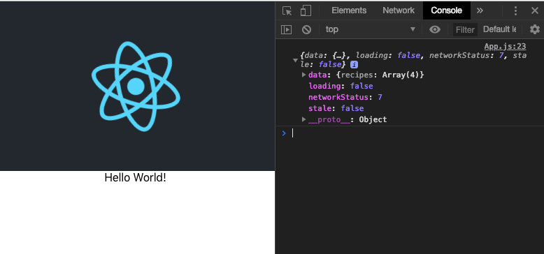
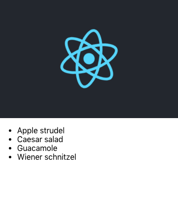

# GraphQL Apollo-Client Workshop

GraphQL es una de las tecnologías mas interesantes hoy en día por una buena razón. Permite a un cliente realizar consultas específicas, complejas y/o agregar consultas de datos, además es fácil de iniciar.

Si has querido aprender GraphQL y comenzar a aprovechar sus poderes, este es un excelente lugar para comenzar.

Este taller es para principiantes de GraphQL con una comprensión básica de React. Se enfoca en la implementación del lado del cliente del uso de GraphQL usando el cliente Apollo.

¡Bienvenido! Hoy aprenderemos cómo construir una aplicación React para consumir datos desde GraphQL utilizando y Apollo Client. ¡Empecemos! 🚀

<p align="center">
  
</p>

## Overview

Este taller le proporcionará una introducción breve pero completa sobre cómo recuperar y actualizar datos remotos desde un *endpoint* GraphQL, así como la administración del estado local utilizando [Apollo Client](https://github.com/apollographql/apollo-client) en combinación con React. La experiencia con React no es obligatoria, pero lo más probable es que sea de mucha ayuda al ver este taller.

Si bien este curso se dirige claramente a los principiantes de Apollo y GraphQL, incluso alguien con bastante experiencia en Apollo podría aprender algo nuevo en la lección sobre cómo administrar el estado local.

Cada lección se centra en una característica o concepto específico y se puede ver de forma independiente. Aún así, todo el taller está cuidadosamente diseñado, por lo que todas las lecciones se combinan para crear una aplicación de libro de cocina. Comienza con la consulta de datos desde un *endpoint* GraphQL.

Después de eso, mejoramos la consulta utilizando variables GraphQL para filtrar resultados. Luego pasamos a las mutaciones, lo que nos permite actualizar los datos. Con las mutaciones, hay bastantes problemas a tener en cuenta.

Usando el estado de enlace de Apollo, incluso podemos extender el esquema remoto GraphQL con capacidades locales. Por último, pero no menos importante, exploramos un par de utilidades bastante útiles que se envían con Apollo, como la *refetching* y *polling*.

Espero que este taller te sea de utilidad y que lo disfrutes. 🙌🏻❤️

## Slides

Si necesita hacer referencia a las diapositivas, puede verlas[aquí](https://fullstack-workshop-apollo.surge.sh).

## Setup instructions
Comenzaremos conociendo la estructura de nuestro repositorio lo cual nos va a facilitar el trabajo, luego con una guía sobre cómo agregar el cliente Apollo a un proyecto existente, luego seguiremos usando los componentes de Consulta y Mutación para obtener y manipular datos usando una API GraphQL.

### Prerequisites

- [Node.js LTS](https://nodejs.org/en/)
- [Git](https://git-scm.com/)
- [GitHub](https://github.com/khriztianmoreno)
- [VSCode](https://code.visualstudio.com/)

También necesitarás instalar [Apollo DevTools for Chrome](https://chrome.google.com/webstore/detail/apollo-client-developer-t/jdkknkkbebbapilgoeccciglkfbmbnfm). Si tienes todo esto, ¡entonces estamos listos para comenzar!

**Estructura del proyecto**
```
apollo-client-workshop-react
├── server
│    ├── models
│    ├── resolvers
│    ├── utils
│    ├── package.json
│    └── index.js
├── client
│    ├── // En este espacio contruiremos nuestro cliente
└── .nvmrc
└── LICENSE
└── README.md
```

### Running server

Nuestro sevidor **GraphQL** necesita precargar unos datos de ejemplo previamente para su funcionamiento

```bash
# Move to server folder
$ cd server

# Install dependencies
$ npm install

# Load data
$ npm run seed

# Run server
$ npm run start:slow
```

*Nota: La [base de datos](https://github.com/louischatriot/nedb) almacena dos archivos JSON almacenados en `/tmp/recipes.json` y `/tmp/ingedients.json`.*

## Branches

- [`00-start`]() Tu punto de partida
- [`01-setup`]() Configuración de Apollo Boost y React Apoll
- [`02-query`]() Escribiendo componentes de consulta


## Client's Installation
Primero iniciemos un proyecto React usando npx y Create React App:

```bash
$ npx create-react-app client
```

A continuación, puede grabar en el proyecto e iniciar un servidor de desarrollo local:

```bash
$ cd client && npm start
```

## Setup and Connect an Apollo Client to a React Application with Apollo Provider
Aprenderemos cómo configurar el cliente Apollo utilizando [Apollo Boost](https://github.com/apollographql/apollo-client/tree/master/packages/apollo-boost), conectarlo a un *endpoint* GraphQL y usar el proveedor Apollo para conectarlo a nuestra aplicación React. Además demostramos cómo usar un **Apollo Consumer**.

Luego de tener nuestra aplicación React creada inicialmente usando `create-react-app`. Vamos a comenzar con Apollo Client, vamos a instarlar las dependencias necesarias para agregar los siguientes paquetes npm, `GraphQL`, `apollo-boost` y `react-apollo.`

**Debemos estar dentro de la carpeta `client`**

```bash
# Install dependencies
$ npm i -S graphql apollo-boost react-apollo
```
El paquete GraphQL es necesario para ciertas características, como el análisis de consultas GraphQL. `Apollo-boost` es un paquete que viene con el `ApolloClient` bien configurado para comenzar rápidamente. Por último, pero no menos importante `react-apollo`, integra Apollo con React proporcionando múltiples componentes y utilidades.

Simplifiqué el por defecto del archivo `/client/src/App.js`.
```jsx
class App extends Component {
  render() {
    return (
      <div className="App">
        <header className="App-header">
          
        </header>

        <div>Hello World!</div>
        
      </div>
    );
  }
}

export default App;
```

Luego, importamos ApolloClient desde `apollo-boost` e instanciamos un nuevo `ApolloClient()`. La única opción obligatoria que debemos proporcionar es **uri**: para nuestro *endpoint* GraphQL. En este caso, estamos usando "http://localhost:4000/", ya que allí ya tengo un servidor GraphQL en ejecución.

```js
import ApolloClient from "apollo-boost";

const client = new ApolloClient({
  uri: "http://localhost:4000/"
});
```

Vamos a verificar que nuestro cliente funciona como se espera al solicitar datos de nuestro *endpoint* GraphQL mediante una consulta. Nuestro `client` espera un objeto que contiene al menos la propiedad de `query`. 

Escribimos uno usando la notación de *template tag*. ¿Qué busca ahora? Nuestro backend es un libro de cocina que contiene recetas. Para empezar, podemos crear todas las recetas. Para cada uno de ellos, solicitamos el `id` y el `title`.

```js
client
  .query({
    query: gql`
      {
        recipes {
          id
          title
        }
      }
    `
  })
```

Si observas, puedes ver que es necesario importar `gql`, esta dependencia es un *template literal string* que analiza las consultas de GraphQL en el estandar *AST*. Las cadenas GraphQL son la forma correcta de escribir consultas en nuestro código, ya que pueden analizarse de forma estática utilizando herramientas como [eslint-plugin-graphql](https://github.com/apollostack/eslint-plugin-graphql). Sin embargo, las cadenas son un inconveniente de manipular, si está tratando de hacer cosas como agregar campos adicionales, combinar varias consultas entre sí u otras cosas interesantes. 

Ahí es donde entra en juego este paquete: le permite escribir sus consultas con los [literales de plantilla de ES2015](https://developer.mozilla.org/en-US/docs/Web/JavaScript/Reference/Template_literals) y compilarlas en un AST con la etiqueta `gql`.

Para utilizarlo solo es necesario agregar la siguiente linea en el top de nuestro archivo:

```js
import gql from "graphql-tag";
```

Volviendo a nuestro código, una vez que la consulta se resuelve, imprimimos los resultados.

```js
client
  .query({
    query: gql`
      {
        recipes {
          id
          title
        }
      }
    `
  })
.then(result => console.log(result));
```

Como puede ver, una vez que cargamos la página, la consulta se ejecutó y nuestro resultado se registró en la consola. Hasta ahora vamos bien.



Ya que tenemos `ReactApollo` disponible, veamos cómo podemos configurarlo y usarlo dentro de nuestra función de render. `import { ApolloProvider } from "react-apollo",`. El `ApolloProvider` requiere una instancia de Apollo `{cliente}` En nuestro caso, tomamos el que ya inicializamos y una vez configurado el `ApolloProvider` ahora pasamos el cliente por el árbol de *rendering* a través de una función de *React context*.

```jsx
import { ApolloProvider } from "react-apollo";

class App extends Component {
  render() {
    return (
      <ApolloProvider client={client}>
        <div className="App">
          <header className="App-header">
            
          </header>
          <div>Hello World!</div>
        </div>
      </ApolloProvider>
    );
  }
}
```

Ahora vamos a usar un `ApolloConsumer`, donde podemos aprovechar esta configuración para usar nuestro cliente para hacer consultas más a fondo en nuestro árbol de renderizado de React.

```js
import { ApolloProvider, ApolloConsumer } from "react-apollo";
```

En este caso, tomamos nuestra consulta existente y la ejecutamos dentro de una *render prop* de `ApolloConsumer`. 

```jsx
class App extends Component {
  render() {
    return (
      <ApolloProvider client={client}>
        <div>Hello World!</div>
        <ApolloConsumer>
          {client => {
            client
            .query({
              query: gql`
                {
                  recipes {
                    id
                   title
                  }
                }
              `
            })
            .then(result => console.log(result));

             return null;
          }}
        </ApolloConsumer>
      </ApolloProvider>
    );
  }
}
```

*Para cumplir con las expectativas de la API de React, devolvimos null.* 

Si bien `ApolloConsumer` puede ser útil en algunos casos, la mayoría de las veces, utilizará el componente de Consulta/Mutación o componentes de orden superior, todos en ReactApollo.

## Fetch Data using the Apollo Query Component

Para mostrar los datos, primero tenemos que buscarlos. El componente `Query` nos permite describir qué datos nos interesan y manejar automáticamente la obtención de nuestros datos. Una vez que recibimos los datos podemos procesarlos usando React. Dado que el componente `Query` maneja la obtención de datos, debemos asegurarnos de que tratamos adecuadamente los casos de un estado de carga, así como el momento en que se reciben los errores de la API de GraphQL. En esta lección cubriremos ambos.

Vamos a comenzar con cambiar nuestro `ApolloConsumer` por el componente `Query`. El componente de *Query* nos permite obtener datos y proporciona los datos como una *render prop*. El componente de consulta tiene un **prop obligatorio**, `query`. Para la consulta, volveremos a utilizar la etiqueta gql con una cadena de consulta dentro de ella. Finalmente tendremos nuestro código de esta forma:

```jsx
import React, { Component } from "react";
import ApolloClient from "apollo-boost";
import gql from "graphql-tag";
import { ApolloProvider, Query } from "react-apollo";

const client = new ApolloClient({
  uri: "http://localhost:4000/"
});

class App extends Component {
  render() {
    return (
      <ApolloProvider client={client}>
        <Query
          query={gql`
            {
              recipes {
                id
                title
              }
            }
          `}
          />
      </ApolloProvider>
    );
  }
}

export default App;
```

El componente `Query` utiliza el patrón de [`render props`](https://reactjs.org/docs/render-props.html) para devolvernos los datos de la consulta. De acuerdo a este patrón el *component child* de `query` debe ser precisamente una función.

```jsx
{
  ({ data }) => {
    if (data.recipes === undefined) return null;

    return (
      <ul>
        {data.recipes.map(({ id, title }) =>
          <li key={id}>{title}</li>
        )}
      </ul>
    )
  }
}
```

Desglosemos las cosas importantes que suceden aquí:

El componente `Query` de Apollo toma un prop *query* requerida con una consulta GraphQL que ha sido analizada usando el `gql` de `graphql-tag`. `Query` también toma una prop requerida `children` que debería ser una función. La función recibe una propiedad a la cual nosotros le hacemos *destructoring* para obtener solo la propiedad `data`, este objeto `data` inicialmente está vacío, pero una vez finalizada la carga, contiene los resultados de nuestra consulta. Validamos que la data tenga `recipes` adjuntas para mostralos en pantalla, de lo contrario `return null`.



Funciona de maravilla.

En este momento, no sabemos por qué nuestras `recipes` no están definidas, simplemente si no estan no las mostramos en pantalla, pero es probable que puedan estar cargandose o que ocurrió un error. Para ayudar con esto, el componente de *query* expone dos propiedades más, `loading` y `error`. Las cuales nos permiten ejecutar una UI diferente según el estado de la consulta.

```jsx
{
  ({ data,loading, error }) => {
    if (loading) return <p>Loading...</p>;
    if (error) return <p>Something went wrong</p>;

    return (
      <ul>
        {data.recipes.map(({ id, title }) =>
          <li key={id}>{title}</li>
        )}
      </ul>
    )
  }
}
```

Si actualizamos la aplicación web, podemos ver nuestra UI de *loading* hasta que finalice la carga y lleguen los datos reales.
Para probar el error de la interfaz de usuario, detenemos el servidor. Como era de esperar, ahora vemos que el caso de error se muestra.

### TODO
Antes de terminar esta lección sobre el componente de consulta, queremos refactorizar el código un poco.

- [-] Extrar el componente de consulta, crear un `recipes.js` .
- [-] Crear una variable `QUERY` para tener nuestro `gql` query.
- [-] Agregar importaciones necesarias.
- [-] Actualizar `App.js` para funcionar con nuestro refactor.


## References

- [apollo-boost](https://github.com/apollographql/apollo-client/tree/master/packages/apollo-boost)
- [graphql-tag](https://github.com/apollographql/graphql-tag)
- [React context](https://reactjs.org/docs/context.html)
- [render props](https://reactjs.org/docs/render-props.html)