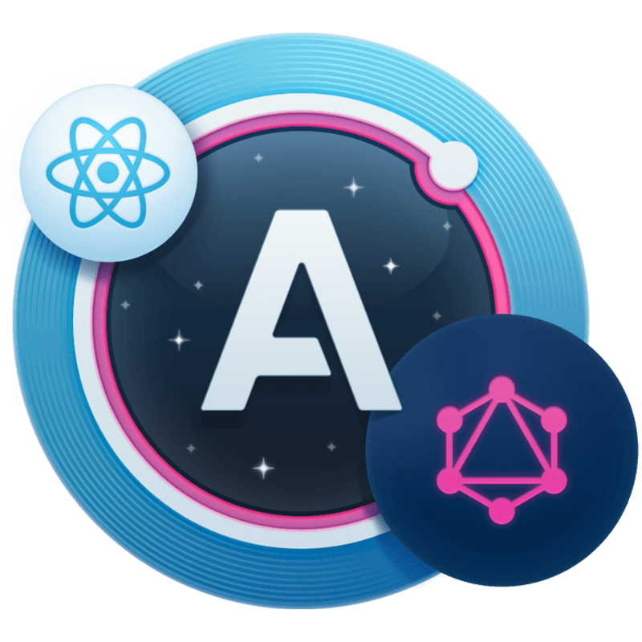

# GraphQL Apollo-Client Workshop

GraphQL es una de las tecnologías mas interesantes hoy en día por una buena razón. Permite a un cliente realizar consultas específicas, complejas y/o agregar consultas de datos, además es fácil de iniciar.

Si has querido aprender GraphQL y comenzar a aprovechar sus poderes, este es un excelente lugar para comenzar.

Este taller es para principiantes de GraphQL con una comprensión básica de React. Se enfoca en la implementación del lado del cliente del uso de GraphQL usando el cliente Apollo.

¡Bienvenido! Hoy aprenderemos cómo construir una aplicación React para consumir datos desde GraphQL utilizando y Apollo Client. ¡Empecemos! 🚀

<p align="center">
  
</p>

## Overview

Este taller le proporcionará una introducción breve pero completa sobre cómo recuperar y actualizar datos remotos desde un *endpoint* GraphQL, así como la administración del estado local utilizando [Apollo Client](https://github.com/apollographql/apollo-client) en combinación con React. La experiencia con React no es obligatoria, pero lo más probable es que sea de mucha ayuda al ver este taller.

Si bien este curso se dirige claramente a los principiantes de Apollo y GraphQL, incluso alguien con bastante experiencia en Apollo podría aprender algo nuevo en la lección sobre cómo administrar el estado local.

Cada lección se centra en una característica o concepto específico y se puede ver de forma independiente. Aún así, todo el taller está cuidadosamente diseñado, por lo que todas las lecciones se combinan para crear una aplicación de libro de cocina. Comienza con la consulta de datos desde un *endpoint* GraphQL.

Después de eso, mejoramos la consulta utilizando variables GraphQL para filtrar resultados. Luego pasamos a las mutaciones, lo que nos permite actualizar los datos. Con las mutaciones, hay bastantes problemas a tener en cuenta.

Usando el estado de enlace de Apollo, incluso podemos extender el esquema remoto GraphQL con capacidades locales. Por último, pero no menos importante, exploramos un par de utilidades bastante útiles que se envían con Apollo, como la *refetching* y *polling*.

Espero que este taller te sea de utilidad y que lo disfrutes. 🙌🏻❤️

## Slides

Si necesita hacer referencia a las diapositivas, puede verlas[aquí](https://fullstack-workshop-apollo.surge.sh).

## Setup instructions
Comenzaremos conociendo la estructura de nuestro repositorio lo cual nos va a facilitar el trabajo, luego con una guía sobre cómo agregar el cliente Apollo a un proyecto existente, luego seguiremos usando los componentes de Consulta y Mutación para obtener y manipular datos usando una API GraphQL.

### Prerequisites

- [Node.js LTS](https://nodejs.org/en/)
- [Git](https://git-scm.com/)
- [GitHub](https://github.com/khriztianmoreno)
- [VSCode](https://code.visualstudio.com/)

También necesitarás instalar [Apollo DevTools for Chrome](https://chrome.google.com/webstore/detail/apollo-client-developer-t/jdkknkkbebbapilgoeccciglkfbmbnfm). Si tienes todo esto, ¡entonces estamos listos para comenzar!

**Estructura del proyecto**
```
apollo-client-workshop-react
├── server
│    ├── models
│    ├── resolvers
│    ├── utils
│    ├── package.json
│    └── index.js
├── client
│    ├── // En este espacio contruiremos nuestro cliente
└── .nvmrc
└── LICENSE
└── README.md
```

### Running server

Nuestro sevidor **GraphQL** necesita precargar unos datos de ejemplo previamente para su funcionamiento

```bash
# Move to server folder
$ cd server

# Install dependencies
$ npm install

# Load data
$ npm run seed

# Run server
$ npm run start:slow
```

*Nota: La [base de datos](https://github.com/louischatriot/nedb) almacena dos archivos JSON almacenados en `/tmp/recipes.json` y `/tmp/ingedients.json`.*

## Branches

- [`00-start`]() Tu punto de partida
- [`01-setup`]()
- [`02-setup`]()


## Client's Installation
Primero iniciemos un proyecto React usando npx y Create React App:

```bash
$ npx create-react-app client
```

A continuación, puede grabar en el proyecto e iniciar un servidor de desarrollo local:

```bash
$ cd client && npm start
```

## Setup and Connect an Apollo Client to a React Application with Apollo Provider
Aprenderemos cómo configurar el cliente Apollo utilizando [Apollo Boost](https://github.com/apollographql/apollo-client/tree/master/packages/apollo-boost), conectarlo a un *endpoint* GraphQL y usar el proveedor Apollo para conectarlo a nuestra aplicación React. Además demostramos cómo usar un **Apollo Consumer**.

Luego de tener nuestra aplicación  React creada inicialmente usando `create-react-app`. Vamos a comenzar con Apollo Client, vamos a instarlar las dependencias necesarias para agregar los siguientes paquetes npm, `GraphQL`, `apollo-boost` y `react-apollo.`

```bash
# Install dependencies
$ npm i -S graphql apollo-boost react-apollo
```

