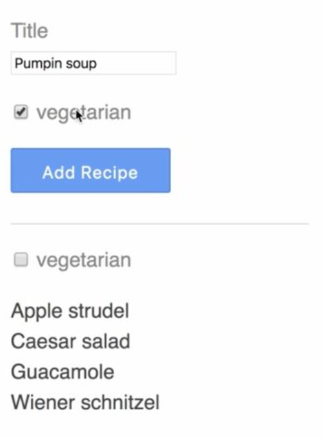
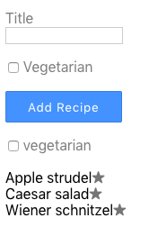

# GraphQL Apollo-Client Workshop

GraphQL es una de las tecnologías mas interesantes hoy en día por una buena razón. Permite a un cliente realizar consultas específicas, complejas y/o agregar consultas de datos, además es fácil de iniciar.

Si has querido aprender GraphQL y comenzar a aprovechar sus poderes, este es un excelente lugar para comenzar.

Este taller es para principiantes de GraphQL con una comprensión básica de React. Se enfoca en la implementación del lado del cliente del uso de GraphQL usando el cliente Apollo.

¡Bienvenido! Hoy aprenderemos cómo construir una aplicación React para consumir datos desde GraphQL utilizando y Apollo Client. ¡Empecemos! 🚀

<p align="center">
  
</p>

## Overview

Este taller le proporcionará una introducción breve pero completa sobre cómo recuperar y actualizar datos remotos desde un *endpoint* GraphQL, así como la administración del estado local utilizando [Apollo Client](https://github.com/apollographql/apollo-client) en combinación con React. La experiencia con React no es obligatoria, pero lo más probable es que sea de mucha ayuda al ver este taller.

Si bien este curso se dirige claramente a los principiantes de Apollo y GraphQL, incluso alguien con bastante experiencia en Apollo podría aprender algo nuevo en la lección sobre cómo administrar el estado local.

Cada lección se centra en una característica o concepto específico y se puede ver de forma independiente. Aún así, todo el taller está cuidadosamente diseñado, por lo que todas las lecciones se combinan para crear una aplicación de libro de cocina. Comienza con la consulta de datos desde un *endpoint* GraphQL.

Después de eso, mejoramos la consulta utilizando variables GraphQL para filtrar resultados. Luego pasamos a las mutaciones, lo que nos permite actualizar los datos. Con las mutaciones, hay bastantes problemas a tener en cuenta.

Usando el estado de enlace de Apollo, incluso podemos extender el esquema remoto GraphQL con capacidades locales. Por último, pero no menos importante, exploramos un par de utilidades bastante útiles que se envían con Apollo, como la *refetching* y *polling*.

Espero que este taller te sea de utilidad y que lo disfrutes. 🙌🏻❤️

## Slides

Si necesita hacer referencia a las diapositivas, puede verlas[aquí](https://slides.com/khriztianmoreno/graphql-apollo-client-workshop).

## Setup instructions
Comenzaremos conociendo la estructura de nuestro repositorio lo cual nos va a facilitar el trabajo, luego con una guía sobre cómo agregar el cliente Apollo a un proyecto existente, luego seguiremos usando los componentes de Consulta y Mutación para obtener y manipular datos usando una API GraphQL.

### Prerequisites

- [Node.js LTS](https://nodejs.org/en/)
- [Git](https://git-scm.com/)
- [GitHub](https://github.com/khriztianmoreno)
- [VSCode](https://code.visualstudio.com/)

También necesitarás instalar [Apollo DevTools for Chrome](https://chrome.google.com/webstore/detail/apollo-client-developer-t/jdkknkkbebbapilgoeccciglkfbmbnfm). Si tienes todo esto, ¡entonces estamos listos para comenzar!

**Estructura del proyecto**
```
apollo-client-workshop-react
├── server
│    ├── models
│    ├── resolvers
│    ├── utils
│    ├── package.json
│    └── index.js
├── client
│    ├── // En este espacio contruiremos nuestro cliente
└── .nvmrc
└── LICENSE
└── README.md
```

### Running server

Nuestro sevidor **GraphQL** necesita precargar unos datos de ejemplo previamente para su funcionamiento

```bash
# Move to server folder
$ cd server

# Install dependencies
$ npm install

# Load data
$ npm run seed

# Run server
$ npm run start:slow
```

*Nota: La [base de datos](https://github.com/louischatriot/nedb) almacena dos archivos JSON almacenados en `/tmp/recipes.json` y `/tmp/ingedients.json`.*

## Branches

- [`00-start`](https://github.com/khriztianmoreno/apollo-client-workshop-react/tree/00-start) Tu punto de partida
- [`01-setup`](https://github.com/khriztianmoreno/apollo-client-workshop-react/tree/01-setup) Configuración de Apollo Boost y React Apoll
- [`02-query`](https://github.com/khriztianmoreno/apollo-client-workshop-react/tree/02-query) Escribiendo componentes de consulta
- [`03-dynamic-queries`](https://github.com/khriztianmoreno/apollo-client-workshop-react/tree/03-dynamic-queries) Asignado variables a nuestra consulta
- [`04-mutations`](https://github.com/khriztianmoreno/apollo-client-workshop-react/tree/04-mutations-form) Escribiendo componentes de mutación
- [`05-schema-extending`](https://github.com/khriztianmoreno/apollo-client-workshop-react/tree/05-schema-extending) Modificando el schema en el cliente
- [`06-refetch`](https://github.com/khriztianmoreno/apollo-client-workshop-react/tree/06-refetch) Obtener datos manualmente en intervalos


## Client's Installation
Primero iniciemos un proyecto React usando npx y Create React App:

```bash
$ npx create-react-app client
```

A continuación, puede grabar en el proyecto e iniciar un servidor de desarrollo local:

```bash
$ cd client && npm start
```

## Setup and Connect an Apollo Client to a React Application with Apollo Provider
Aprenderemos cómo configurar el cliente Apollo utilizando [Apollo Boost](https://github.com/apollographql/apollo-client/tree/master/packages/apollo-boost), conectarlo a un *endpoint* GraphQL y usar el proveedor Apollo para conectarlo a nuestra aplicación React. Además demostramos cómo usar un **Apollo Consumer**.

Luego de tener nuestra aplicación React creada inicialmente usando `create-react-app`. Vamos a comenzar con Apollo Client, vamos a instarlar las dependencias necesarias para agregar los siguientes paquetes npm, `GraphQL`, `apollo-boost` y `react-apollo.`

**Debemos estar dentro de la carpeta `client`**

```bash
# Install dependencies
$ npm i -S graphql apollo-boost react-apollo
```
El paquete GraphQL es necesario para ciertas características, como el análisis de consultas GraphQL. `Apollo-boost` es un paquete que viene con el `ApolloClient` bien configurado para comenzar rápidamente. Por último, pero no menos importante `react-apollo`, integra Apollo con React proporcionando múltiples componentes y utilidades.

Simplifiqué el por defecto del archivo `/client/src/App.js`.
```jsx
class App extends Component {
  render() {
    return (
      <div className="App">
        <header className="App-header">
          
        </header>

        <div>Hello World!</div>

      </div>
    );
  }
}

export default App;
```

Luego, importamos ApolloClient desde `apollo-boost` e instanciamos un nuevo `ApolloClient()`. La única opción obligatoria que debemos proporcionar es **uri**: para nuestro *endpoint* GraphQL. En este caso, estamos usando "http://localhost:4000/", ya que allí ya tengo un servidor GraphQL en ejecución.

```js
import ApolloClient from "apollo-boost";

const client = new ApolloClient({
  uri: "http://localhost:4000/"
});
```

Vamos a verificar que nuestro cliente funciona como se espera al solicitar datos de nuestro *endpoint* GraphQL mediante una consulta. Nuestro `client` espera un objeto que contiene al menos la propiedad de `query`.

Escribimos uno usando la notación de *template tag*. ¿Qué busca ahora? Nuestro backend es un libro de cocina que contiene recetas. Para empezar, podemos crear todas las recetas. Para cada uno de ellos, solicitamos el `id` y el `title`.

```js
client
  .query({
    query: gql`
      {
        recipes {
          id
          title
        }
      }
    `
  })
```

Si observas, puedes ver que es necesario importar `gql`, esta dependencia es un *template literal string* que analiza las consultas de GraphQL en el estandar *AST*. Las cadenas GraphQL son la forma correcta de escribir consultas en nuestro código, ya que pueden analizarse de forma estática utilizando herramientas como [eslint-plugin-graphql](https://github.com/apollostack/eslint-plugin-graphql). Sin embargo, las cadenas son un inconveniente de manipular, si está tratando de hacer cosas como agregar campos adicionales, combinar varias consultas entre sí u otras cosas interesantes.

Ahí es donde entra en juego este paquete: le permite escribir sus consultas con los [literales de plantilla de ES2015](https://developer.mozilla.org/en-US/docs/Web/JavaScript/Reference/Template_literals) y compilarlas en un AST con la etiqueta `gql`.

Para utilizarlo solo es necesario agregar la siguiente linea en el top de nuestro archivo:

```js
import gql from "graphql-tag";
```

Volviendo a nuestro código, una vez que la consulta se resuelve, imprimimos los resultados.

```js
client
  .query({
    query: gql`
      {
        recipes {
          id
          title
        }
      }
    `
  })
.then(result => console.log(result));
```

Como puede ver, una vez que cargamos la página, la consulta se ejecutó y nuestro resultado se registró en la consola. Hasta ahora vamos bien.


Ya que tenemos `ReactApollo` disponible, veamos cómo podemos configurarlo y usarlo dentro de nuestra función de render. `import { ApolloProvider } from "react-apollo",`. El `ApolloProvider` requiere una instancia de Apollo `{cliente}` En nuestro caso, tomamos el que ya inicializamos y una vez configurado el `ApolloProvider` ahora pasamos el cliente por el árbol de *rendering* a través de una función de *React context*.

```jsx
import { ApolloProvider } from "react-apollo";

class App extends Component {
  render() {
    return (
      <ApolloProvider client={client}>
        <div className="App">
          <header className="App-header">
            
          </header>
          <div>Hello World!</div>
        </div>
      </ApolloProvider>
    );
  }
}
```

Ahora vamos a usar un `ApolloConsumer`, donde podemos aprovechar esta configuración para usar nuestro cliente para hacer consultas más a fondo en nuestro árbol de renderizado de React.

```js
import { ApolloProvider, ApolloConsumer } from "react-apollo";
```

En este caso, tomamos nuestra consulta existente y la ejecutamos dentro de una *render prop* de `ApolloConsumer`.

```jsx
class App extends Component {
  render() {
    return (
      <ApolloProvider client={client}>
        <div>Hello World!</div>
        <ApolloConsumer>
          {client => {
            client
            .query({
              query: gql`
                {
                  recipes {
                    id
                   title
                  }
                }
              `
            })
            .then(result => console.log(result));

             return null;
          }}
        </ApolloConsumer>
      </ApolloProvider>
    );
  }
}
```

*Para cumplir con las expectativas de la API de React, devolvimos null.*

Si bien `ApolloConsumer` puede ser útil en algunos casos, la mayoría de las veces, utilizará el componente de Consulta/Mutación o componentes de orden superior, todos en ReactApollo.

## Fetch Data using the Apollo Query Component

Para mostrar los datos, primero tenemos que buscarlos. El componente `Query` nos permite describir qué datos nos interesan y manejar automáticamente la obtención de nuestros datos. Una vez que recibimos los datos podemos procesarlos usando React. Dado que el componente `Query` maneja la obtención de datos, debemos asegurarnos de que tratamos adecuadamente los casos de un estado de carga, así como el momento en que se reciben los errores de la API de GraphQL. En esta lección cubriremos ambos.

Vamos a comenzar con cambiar nuestro `ApolloConsumer` por el componente `Query`. El componente de *Query* nos permite obtener datos y proporciona los datos como una *render prop*. El componente de consulta tiene un **prop obligatorio**, `query`. Para la consulta, volveremos a utilizar la etiqueta gql con una cadena de consulta dentro de ella. Finalmente tendremos nuestro código de esta forma:

```jsx
import React, { Component } from "react";
import ApolloClient from "apollo-boost";
import gql from "graphql-tag";
import { ApolloProvider, Query } from "react-apollo";

const client = new ApolloClient({
  uri: "http://localhost:4000/"
});

class App extends Component {
  render() {
    return (
      <ApolloProvider client={client}>
        <Query
          query={gql`
            {
              recipes {
                id
                title
              }
            }
          `}
          />
      </ApolloProvider>
    );
  }
}

export default App;
```

El componente `Query` utiliza el patrón de [`render props`](https://reactjs.org/docs/render-props.html) para devolvernos los datos de la consulta. De acuerdo a este patrón el *component child* de `query` debe ser precisamente una función.

```jsx
{
  ({ data }) => {
    if (data.recipes === undefined) return null;

    return (
      <ul>
        {data.recipes.map(({ id, title }) =>
          <li key={id}>{title}</li>
        )}
      </ul>
    )
  }
}
```

Desglosemos las cosas importantes que suceden aquí:

El componente `Query` de Apollo toma un prop *query* requerida con una consulta GraphQL que ha sido analizada usando el `gql` de `graphql-tag`. `Query` también toma una prop requerida `children` que debería ser una función. La función recibe una propiedad a la cual nosotros le hacemos *destructoring* para obtener solo la propiedad `data`, este objeto `data` inicialmente está vacío, pero una vez finalizada la carga, contiene los resultados de nuestra consulta. Validamos que la data tenga `recipes` adjuntas para mostralos en pantalla, de lo contrario `return null`.


Funciona de maravilla.

En este momento, no sabemos por qué nuestras `recipes` no están definidas, simplemente si no estan no las mostramos en pantalla, pero es probable que puedan estar cargandose o que ocurrió un error. Para ayudar con esto, el componente de *query* expone dos propiedades más, `loading` y `error`. Las cuales nos permiten ejecutar una UI diferente según el estado de la consulta.

```jsx
{
  ({ data,loading, error }) => {
    if (loading) return <p>Loading...</p>;
    if (error) return <p>Something went wrong</p>;

    return (
      <ul>
        {data.recipes.map(({ id, title }) =>
          <li key={id}>{title}</li>
        )}
      </ul>
    )
  }
}
```

Si actualizamos la aplicación web, podemos ver nuestra UI de *loading* hasta que finalice la carga y lleguen los datos reales.
Para probar el error de la interfaz de usuario, detenemos el servidor. Como era de esperar, ahora vemos que el caso de error se muestra.

### TODO
Antes de terminar esta lección sobre el componente de consulta, queremos refactorizar el código un poco.

- [-] Extrar el componente de consulta, crear un `recipes.js` .
- [-] Crear una variable `QUERY` para tener nuestro `gql` query.
- [-] Agregar importaciones necesarias.
- [-] Actualizar `App.js` para funcionar con nuestro refactor.

## Provide Dynamic Arguments in a Apollo Query Component with GraphQL Variables

GraphQL soporta parámetros para consultas vía variables. Nos permiten aportar argumentos dinámicos. A menudo queremos que estas variables dependan de las decisiones tomadas por un usuario. En esta sesión, veremos cómo implementar una variable de filtro basada en un elemento de checkbox en la UI utilizando el componente de consulta de Apollo.

Para filtrar recetas vegetarianas, nuestra receta acepta un argumento booleano, `vegetarian`.

```js
const QUERY = gql`
{
  recipes(vegetarian: true)  {
    id
    title
  }
}
`
```

Una vez que la página se vuelve a cargar, podemos ver que ahora solo aparecen recetas vegetarianas.

En esta lección, queremos que el argumento vegetariano dependa de una casilla de verificación, que puede ser controlada por un usuario.

Antes de hacerlo, comencemos con algunos conceptos básicos. Usando la etiqueta de la plantilla `gql`, podemos asegurarnos de que un `query` debe proporcionarse con ciertas variables.

Primero declaramos un nombre para una consulta específica, usando la sintaxi de `query` y luego el nombre. Entonces indicamos que la variable `vegetarian` es de tipo `Boolean!`. Al agregar un signo de exclamación (`!`), declaramos esta variable como obligatoria.

```js
const QUERY = gql`
  query recipes($vegetarian: Boolean! {
    recipes(vegetarian: $ vegetarian) {
      id
      title
    }
  }
`;
```

Para proveer variables al componente `Query`, simplemente agregamos otra prop, `variables`. Esta prop acepta un objeto con las variables de consulta como propiedades clave-valor. En nuestro caso, nos propusimos `vegetarian: true`.

```jsx
const Recipes = () => (
  <Query query={QUERY} variables={{ vegetarian: true}}>
    ...
  </Query>
)
```

Ahora, actualizamos el navegador y verificamos que solo vemos comidas vegetarianas.

### TODO

A continuación, queremos implementar la casilla de verificación de la interfaz de usuario y hacer un seguimiento de su estado.

- [-] Crear un checkbox con el label *vegetarian*.
- [-] Capturar el evento `onChange` para este field.
- [-] Actualizar el estado con el valor del *checkbox*.
- [-] Asignar el estado a la variable `vegetarian` del componente `Query`.
- [-] **BONUS!!** Usar [React Hooks](https://reactjs.org/docs/hooks-reference.html).

## Update Data using the Apollo Mutation component
En esta lección, usaremos el componente Mutación para invocar una mutación de una API GraphQL. Además, cubrimos cómo actualizar la memoria caché local mediante consultas de recuperación, así como mejorar la experiencia del usuario cuando se trata de mutaciones. Al final, discutimos varios errores relacionados con las mutaciones y las posibles formas de abordarlos.

Para esta lección, vamos a comenzar con las tareas que tú debes terminar para poder avanzar. La idea es crear un un componente `AddRecipe` que contenga dos campos de entrada, uno para el título y otro para indicar si la receta es una receta vegetariana.



### TODO

- [-] Crear componenete `AddRecipe`.
- [-] Agregar campo `title` al formulario.
- [-] Agregar campo `vegetarian` de tipo *checkbox* al formulario.
- [-] Actualizar el estado con los valores del formulario.
- [-] **BONUS!!** Usar [React Hooks](https://reactjs.org/docs/hooks-reference.html).

Si hace clic en el botón Agregar, no ocurrirá nada en este momento, excepto hacer que los campos se limpien.

**Implementamos mutaciones básicas.**

Vamos a enviar la nueva información de la receta(formulario que debimos crear previamente) a nuestro back-end GraphQL. Vamos a nuestro componente `AddReecipe` y al principio importamos `mutation`

```js
import { mutation } from "react-apollo";
```

Luego envolvemos nuestro formulario con este componente. Tiene un prop obligatoria, que es `mutation`. En nuestro caso, queremos agregar un `addRecipe` ya que nuestro backend asi lo estableció.

```jsx
render() {
  return (
    <Mutation mutation={ADD_RECIPE_MUTATION}>
    ...
    </mutation>
  )
}
```

Dado que todavía no tenemos tal mutación, necesitamos crearla. Al igual que con las consultas, vamos a utilizar el template tag `gql`.

```js
const ADD_RECIPE_MUTATION = gql`
  mutation addRecipe($recipe: RecipeInput!) {
    addRecipe(recipe: $recipe)
    {
      id
      title
    }
}
`
```

Ahora que tenemos nuestra mutación lista, usémosla. El *componenet child*  de `mutation` debe ser exactamente una función. Esto es llamado *render prop*. El llamado con la función de mutar que llamada `addRecipe` de acuerdo a la definición del backend. El segundo argumento es un objeto que contiene un resultado de `mutation`, así como el estado de `loading` y `error`.

```jsx
render() {
  return (
    <Mutation mutation={ADD_RECIPE_MUTATION}> {(addRecipe, { loading, error })

    ...
```

Una vez que se envía el formulario, podemos usar nuestra función `addRecipe` para desencadenar la `mutation` y pasar el objeto de la receta, que contiene la propiedad `title` y `vegetarian`.

```jsx
{(addRecipe, { loading, error }) => (
  <form
    onSubmit={evt => {
      evt.preventDefault();
      addRecipe({
        variables: {
          recipe: { title: this.state.title, vegetarian: this.state.vegetarian }
        }
      });
    }}
```
¿Terminamos? Aún no. A favor de un buen UX, también debemos indicar el estado de carga e informar al usuario, en caso de que se produzca un error. Esto es todo lo que necesitamos para implementar la mutación.

```jsx
<div>
  <button>Add Recipe</button>
  {loading && <p>Loading...</p>}
  {error && <p>Error :( Please try again</p>}
</div>
```

Podemos ir al navegador y hacer clic en el botón *Add Recipe* para enviar el formulario. Aunque estoy seguro de que nuestra mutación **tuvo éxito**, no vemos reflejado nuestra nueva receta en la lista.

Este es el causado porque la consulta que trae la lista de recetas **se encuentra en otro componente**. De ninguna manera indicamos que esta lista debería actualizarse una vez que la mutación haya finalizado. Podemos verificar rápidamente que nuestra mutación tuvo éxito solo con actualizar la página.

Ahora, queremos actualizar la lista con la mutación. Por lo tanto, podemos usar la prop `refetchQueries` en el componente `Mutation`. Esto acepta una serie de consultas, que se volverán a ejecutar una vez que la mutación haya tenido éxito. Vamos a proporcionar nuestra consulta de `recipes`.

```jsx
render() {
  return (
    <Mutation
      mutation={ADD_RECIPE_MUTATION}
      refetchQueries={[
        {
          query: gql`
            query recipes {
              recipes {
                id
                title
              }
            }
        } `
      ]}
    >
    {(addRecipe, { loading, error })
...
```

Desafortunadamente, esto no funcionará, porque la consulta en el componente `Recipes` acepta una variable `vegetarian` y por lo tanto, es diferente.

Esto significa que debemos pasar exactamente la misma consulta, con exactamente las mismas variables. Si bien podríamos copiarlo y pegarlo ahora, en este punto, probablemente sea mejor si exportamos la consulta y la importamos en este archivo, así como en la receta.

```js
export const QUERY = gql`
  query recipes($vegetarian: Boolean!) {
    recipes(vegetarian: $vegetarian) {
      id
      title
    }
  }
`;
```

Luego usamos las consultas de recetas dentro de la `refetchQueries`, donde pasamos un objecto vegetarianos y otro que no lo son.

```jsx
<Mutation
  mutation={ADD_RECIPE_MUTATION}
  refetchQueries={[
    { query: QUERY, variables: { vegetarian: false } },
    { query: QUERY, variables: { vegetarian: true } },
  ]}
>
```

Vamos a intentarlo. Añadimos una nueva receta. Luego veremos cómo se activan las `refetchQueries` después de que la mutación haya finalizado con éxito. Esto, sin embargo, podría no ser la experiencia de usuario deseada que está buscando. Personalmente prefiero si el indicador de carga permanece activo hasta que se actualicen las `refetchQueries`. Afortunadamente, este comportamiento es trivial de implementar simplemente agregando un prop `awaitRefetchQueries` y configurándolo en `true`.

```jsx
<Mutation
  mutation={ADD_RECIPE_MUTATION}
  refetchQueries={[
    { query: QUERY, variables: { vegetarian: false } },
    { query: QUERY, variables: { vegetarian: true } },
  ]}
  awaitRefetchQueries={true}
>
```

Vamos a actualizar la página. Luego añadimos otro plato vegetariano. Como puede ver, esta receta apareció en la lista al mismo tiempo que desaparecía el indicador de carga. Si activamos el filtro vegetariano, la lista se procesa instantáneamente, ya que ya hemos actualizado el caché usando `refetchQueries`.

Al principio es molesto tener que lidiar con la cache que se genera con Apollo Client. Si desea comenzar de manera simple, he visto a los desarrolladores hacer esto un par de veces y es desactivar el caché de Apollo de forma predeterminada y solo usarlo explícitamente, en caso de que sus optimizaciones tengan un gran impacto en la experiencia del usuario.

## Manage Local State using Apollo by extending the GraphQL Schema on the Client

Con la introducción de `apollo-link-state`, Apollo introdujo por primera vez una forma de administrar el estado local a través de consultas y mutaciones de GraphQL. Esto se puede lograr utilizando la directiva `@client`. En esta lección, aprovecharemos esta función para realizar un seguimiento de las recetas destacadas y almacenar la información en el `localStorage`.

En esta lección, queremos extender nuestra aplicación para permitir a los usuarios marcar sus recetas favoritas. Por lo tanto, queremos agregar un campo `isStarred` a la receta. Dado que nuestro esquema no admite este campo, planeamos mantener esta información únicamente en el cliente, almacenado unicamente en local.

Para consultar un campo solo en el cliente, podemos aprovechar el decorador `@client` y agregarlo a un campo en una consulta o una mutación.

```js
import gql from "graphql-tag";

export const GET_RECIPES = gql`
  query recipes($vegetarian: Boolean!) {
    recipes(vegetarian: $vegetarian) {
      id
      title
      isStarred @client
    }
  }
`;
```
Una vez agregado, este campo nunca se consulta en el punto final remoto, sin embargo, necesitamos proporcionar un resolver para esto. En nuestro archivo `app.js`, tendremos un objecto `resolver`  y para el tipo `recipe` agregue un resolver `isStarred`. Temporalmente vamos a devolver el valor `false` para todos los `recipes`.

```js
const resolvers = {
  Recipe: {
    isStarred: parent => false
  }
}
```

Luego podemos usar el objeto del *resolver* y pasarlo a la propiedad `clientState` durante la inicialización de `ApolloClient`.

```js
const client = new ApolloClient({
  uri: "http://localhost:4000/",
  clientState: {
    resolvers
  }
});
```
Esto es todo lo que necesitamos para poder recuperar el valor `isStarred` en nuestra lista de `Recipes.js`. Procesamos una estrella junto a cada uno de los títulos, y el color debería cambiar, según el estado. Naranja, si la receta está marcada y gris si no lo está.

```jsx
return (
  <ul>
    {data.recipes.map(({ id, title, isStarred }) => (
      <li key={id}>
        {title}
        <span style={{ color: isStarred ? "orange" : "grey" }}>
          ★
        </span>
      </li>
```
Actualicemos la página y verifiquemos que todas las estrellas estén inactivas.



A continuación, necesitamos una mutación que nos permita actualizar el campo `isStarred` de una receta. Por lo tanto, extendemos nuestros *resolvers* del lado del cliente con una mutación que vamos a llamar `updateRecipeStarred`. Nuestro plan es almacenar un array de recetas destacadas en el `localstorage`. Antes de actualizarlo, recuperamos la lista.

```js
Mutation: {
  updateRecipeStarred: (_, variables) => {
    const starredRecipes = JSON.parse(localStorage.getItem("starredRecipes")) || [];
  }
}

// Signature
// fieldName(obj, args, context, info) { result }
```
Para conocer la firma de los resolvers puede ir [aquí](https://www.apollographql.com/docs/graphql-tools/resolvers.html#Resolver-function-signature)

En caso de que la variable `isStarred` se establezca en `true`, añadimo el `id` actual al *localstorage*. En caso de que esté configurado como `false`, filtramos la lista actual de ID's del *localstorage* para guardar de nuevo los ID's sin el actual.

```js
Mutation: {
  updateRecipeStarred: (_, variables) => {
    const starredRecipes = JSON.parse(localStorage.getItem("starredRecipes")) || [];

    if (variables.isStarred) {
      const addItem = JSON.stringify(starredRecipes.concat([variables.id]))
      localStorage.setItem("starredRecipes", addItem);
    } else {
      const removeItem = JSON.stringify(starredRecipes.filter(recipeId => recipeId !== variables.id))
      localStorage.setItem("starredRecipes", removeItem);
    }

  }
}
```

Al final, devolvemos un objeto con `__typename` y el valor `isStarred`. Esto es útil en caso de que un desarrollador quiera consultar el valor actualizado.

```js
Mutation: {
  updateRecipeStarred: (_, variables) => {
    ...

    return {
      __typename: "Recipe",
      isStarred: variables.isStarred
    };
  }
}
```

Como ahora tenemos la mutación y sabemos cómo almacenamos las recetas destacadas, también puede actualizar el codigo del resolver de `recipes`. En el *resolver*, verificamos si el array `starredRecipes` incluye el ID de la receta `parent.id` actual y devolvemos el resultado.

```js
const resolvers = {
  Recipe: {
    isStarred: parent => {
      const starredRecipes = JSON.parse(localStorage.getItem("starredRecipes")) || [];
      return starredRecipes.includes(parent.id);
    }
  },
```

Hasta este punto solo estabamos preparando el terreno, ahora tenemos todo lo que necesitamos para comenzar a usar nuestra mutación. Por lo tanto, agregamos una nueva mutación al archivo `src/components/Recipes.js`.

```js
const UPDATE_RECIPE_STARRED_MUTATION = gql`
  mutation updateRecipeStarred($id: ID!, $isStarred: Boolean!) {
    updateRecipeStarred(id: $id, isStarred: $isStarred) @client
  }
`;
```

Después de eso, importamos el componente `Mutation` y envolvemos el `span` con la estrella con él.

```js
import { Query, Mutation } from "react-apollo";
```

Luego pasamos nuestro `UPDATE_RECIPE_STARRED_MUTATION`. Dado que esta mutación afecta el resultado de nuestra consulta de recetas, proporcionamos los dos `refetchQeries`.

```jsx
<Mutation
  mutation={UPDATE_RECIPE_STARRED_MUTATION}
  refetchQueries={[
    { query: GET_RECIPES, variables: { vegetarian: false } },
    { query: GET_RECIPES, variables: { vegetarian: true } }
  ]}
  awaitRefetchQueries={true}
>
```
Una vez más, establezca `awaitRefetchQueries` en verdadero. Después de eso, reemplazamos el `<span>` con un `<button>` y agregamos un evento `onClick`. Una vez que se hace clic, invocamos la mutación con el `ID` de receta actual y el valor inverso `!IsStarred`.

```jsx
<Mutation
  mutation={UPDATE_RECIPE_STARRED_MUTATION}
  refetchQueries={[
   ...
  ]}
  awaitRefetchQueries={true}
>
  {
    (updateRecipeStarred, { loading, error }) => (
      <button
        className="star-btn"
        style={{...}}
        onClick={() =>
          updateRecipeStarred({
            variables: { id, isStarred: !isStarred }
          })
        }
      >
        ★
      </button>
    )
  }
</Mutation>
```

A continuación, agregamos una clase llamada `star-btn`. Para asegurarme de que la estrella se vea realmente bien, agregué la clase al archivo `index.html`.

```html
<style>
  .star-btn {
    position: absolute;
    padding: 0;
    margin: 0 0 0 0.3rem;
    height: 1.4rem;
    line-height: 1.4rem;
    background: none;
    border: 0;
    font-size: 1rem;
    outline: 0
  }
  .star-btn:hover {
    background: none;
    opacity: 0.8;
  }

  .star-btn:focus {
    box-shadow: none;
  }

  @keyframes inflate {
    0% {
      font-size: 1rem;
      margin-left: 0.3rem;
    }
    100% {
      font-size: 1.4rem;
      margin-left: 0.1rem;
    }
  }
</style>
```

Dependiendo del estado `loading`, agregamos la `animation`. Por último, pero no menos importante, renderizar texto en caso de que se produzca un `error`. Ahora, deberíamos poder comenzar nuestras recetas.

```jsx
(updateRecipeStarred, { loading, error }) => (
  <button
    className="star-btn"
    style={{
      color: isStarred ? "orange" : "grey",
      animation: loading ? "inflate 0.7s ease infinite alternate" : "none"
    }}
    onClick={() =>
      updateRecipeStarred({
        variables: { id, isStarred: !isStarred }
      })
    }
  >
    ★ {error && "Failed to update"}
  </button>
)
```

Actualizamos la página y le damos una oportunidad. Voila, funciona como un amuleto. Incluso funciona después de comprobar el filtro vegetariano.

## Refetch Data with the Apollo Query Component either Manually or on Timed Intervals
En esta lección, primero exploraremos cómo recuperar manualmente los datos de una consulta ya ejecutada para recibir el estado más reciente de nuestros datos. Más tarde, utilizamos el *polling* para recuperar el último estado en un intervalo de tiempo. El *polling* puede ser una herramienta simple y efectiva para proporcionar una experiencia casi en tiempo real sin la sobrecarga de configurar una solución WebSocket.

Hasta ahora, utilizamos `data`, `loading`, `error` desde la función *render prop* de un componente de `Query`. Hay un par de utilidades más que vienen con este objeto. Uno de ellos es `refetch`.

```jsx
<Query query={GET_RECIPES} variables={{ vegetarian: checked.vegetarian }}>
  {
    ({ data, loading, error, refetch }) => {
      if (loading) return <p>Loading…</p>;
      if (error) return <p>Something went wrong</p>;

      return (
        ...
      )
  }
</Query>
```

Una vez invocado, se volverá a ejecutar la consulta. Vamos a intentarlo agregando un `<button>` para actualizar las recetas.

```jsx
<React.Fragment>
  ...

  <button onClick={() => refetch()}> Refresh Recipes</button>
</React.Fragment>
```

Una vez implementado, agregamos un nuevo elemento en otro navegador, volvemos a nuestro anterior tab y ejecutamos la recuperación presionando el botón. Como era de esperar, ahora vemos la nueva receta que se está agregando. Otros ejemplos de utilidades que vienen dentro del *render prop* del componente `Query` son: *network status*, obtener más datos con *pagination* o iniciar y detener el *polling*.

Dicho esto, la forma más fácil de lograr el *polling* para obtener nuevos resultados es usar la prop `pollInterval` en el propio componente de consulta. De forma predeterminada, está desactivado, pero si proporciona un número como `{3000}`, el componente volverá a ejecutar la consulta cada tres segundos.

```jsx
<Query
  query={GET_RECIPES}
  variables={{ vegetarian: checked.vegetarian }}
  pollInterval={3000}
>
```

Puedes probar creando otra nueva receta en otra pestaña y como puedes ver en la pestaña anterior del navegador, se puede ver en pocos segundos esta nueva recenta sin hacer un web socket, el *polling* puede ser una herramienta simple y efectiva para proporcionar una experiencia en tiempo casi real.

Con esto llegamos al final de este taller basico sobre **Apollo Client**

**¡Espero que esto haya sido útil y/o te haya hecho aprender algo nuevo!**


## Author

* **Cristian Moreno** - *FullStack JavaScript Developer* - [Github](https://github.com/khriztianmoreno)
See also the list of [contributors](https://github.com/khriztianmoreno/apollo-client-workshop-react/contributors) who participated in this project.

## License

This project is licensed under Copy Right - see the [LICENSE](LICENSE) file for details

## References

- [apollo-boost](https://github.com/apollographql/apollo-client/tree/master/packages/apollo-boost)
- [graphql-tag](https://github.com/apollographql/graphql-tag)
- [React context](https://reactjs.org/docs/context.html)
- [render props](https://reactjs.org/docs/render-props.html)
- [Caching data](https://www.apollographql.com/docs/react/advanced/caching.html)
- [React Hooks](https://reactjs.org/docs/hooks-reference.html)
- [Apollo Query props](https://www.apollographql.com/docs/react/essentials/queries.html#propsgit )
- [Resolvers](https://www.apollographql.com/docs/graphql-tools/resolvers.html)
